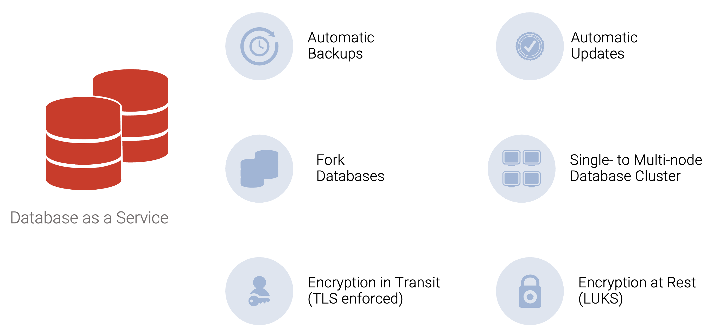
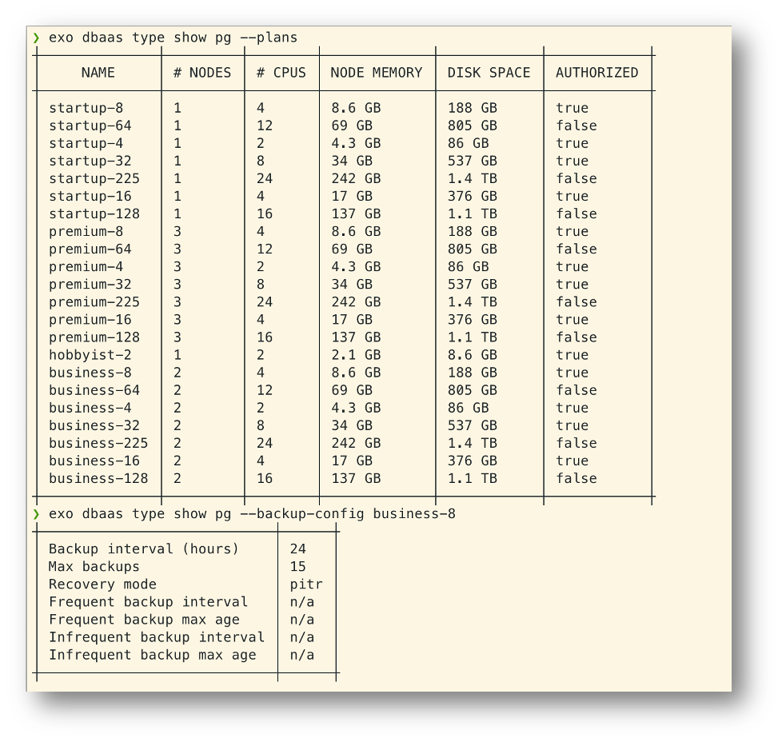
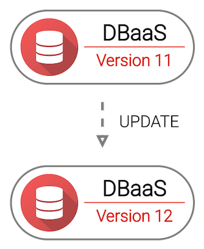
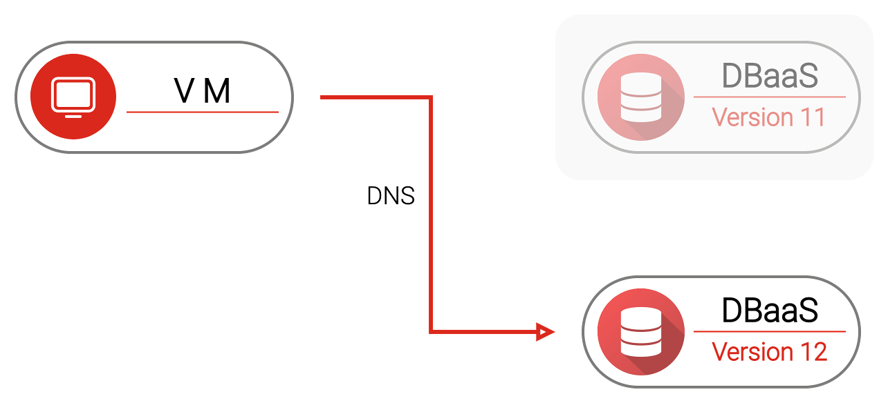

Overview

Looking at databases, we see that the managed version delivers the benefits of simplifying the tasks associated with provisioning and maintaining a database. However, you will still need some experience working with databases to interact with them as you build and scale your app.

Exoscale DBaaS is an excellent solution for everyone looking for a diverse portfolio of open-source data services used in all applications and business solutions and gaining the following benefits:

- **Daily Backups included** - backups are done on a daily basis and are included with every DBaaS offering.
- **Completely Integrated** - integrated DBaaS for your instances. Easily manage your database, instance, or storage from the same interface.
- **Automate Everything** - easily automate everything with our simple web portal, CLI, API, or tools like Terraform.
- **99.99% Uptime SLA** - all DBaaS (cluster) offerings come with an uptime SLA of 99.99%.
- **No Vendor Lock-In** - keep your cloud infrastructure independent and flexible with our offering of open-source databases.
- **Your Data Stays In Europe** - all data is stored in the country of your chosen zone, fully GDPR compliant. DBaaS is available across European zones.

### DBaas Plans

### DBaaS Update
**Update Process – how does it work ?**

Database always accessible via a DNS-Address

Update Process handles everything fully automatic in the background:

- Fork database, and synchronize all data
- Test whether new databases is healthy
- Point DNS now to new DBaaS instance
- Old instance is discarded
- Clients will reconnect

**->** Downtime of less than 10 seconds

**Update Process - Step 1**

**Update Process - Step 2**

**Update Process - Step 3**

### DBaaS - Further Possibilities

What is possible depending on the database:

- Attach external read replicas
- Use a variety of extensions
- Use multiple nodes
- Change specific parameters of the database
- Migrate from the old provider
- Connection pooling

**->** Consider our Managed Database as a Server DBaaS

**->** Intro Course available: Database technologies and benefits of managed database services
