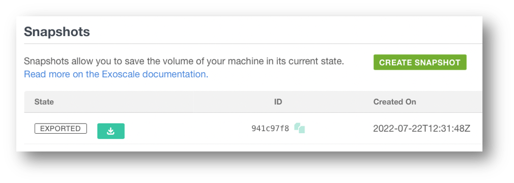

Explained
Solutions:

- Backup solutions existed well before cloud services were invented
- Companies or teams had their specific preferred backup solution
- Exoscale does not impose a specific solution
- Multiple possibilities available

### Snapshots
Do a full snapshot of a VM

- Easy to implement and automate
- Easy to fully restore Restores
- Easily create a template from a Snapshot

Hard to do partial restores

- Always the full disk is snapshotted -> Consumes a lot of space and incurs cost
- When a VM is deleted, Snapshots are also deleted
- Can be inconsistent, e.g., recovery of a Database might not be possible.

### Agent Based Backup
Backup the filesystem to an S3 bucket (potentially in a different zone):

- Incremental
- Partial restores
- Great flexibility
- Economical
- Harder to implement -> Requires a third-party application



Restoring – Option A:

- Restore file system directly (i.e., using Restic)



Restoring – Option B:

- Restore whole system (i.e., using UrBackup, Bareos)


