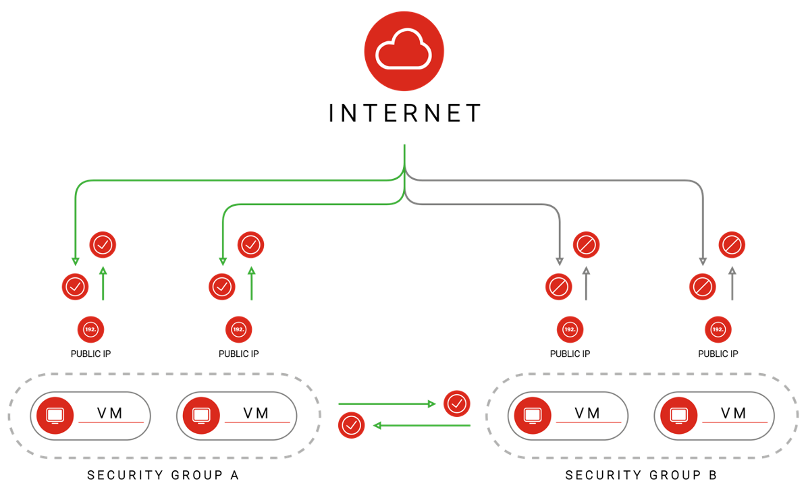
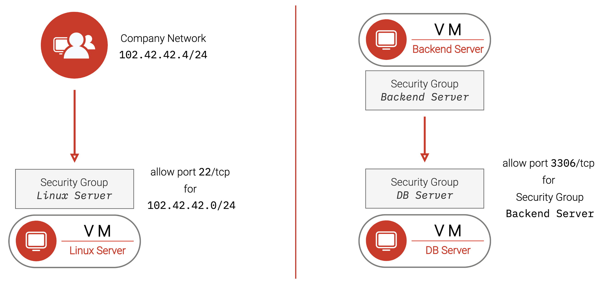

Explained

- Can forward ports/services to different Instance Pools.

- Traffic will be only forwarded to Instance Pool members with a successful health check.

- If you want to allow access from the Internet, you need to open the Ingress Rules for target-port and healthcheck for all (0.0.0.0) in the Instance-Pools Security Group.

    - If you only want to enable load balancing from specific subnets, you can just let that subnet or security group access the target-port. Additionally, you need to add a rule with Source Type being Security-Group-Public and select public-nlb-healthcheck-sources for the healthcheck.

- Healthchecks can be observed via API.

- Strategies

   - Round-Robin - Incoming traffic will be forwarded to each member in equal proportions and circular order.
   - Source-Hash - A given source address will always be forwarded to the same instance.



[nlb](nlb.png)


### Managed Elastic IP

- Can forward traffic to one instance or distribute traffic across multiple instances
- Traffic distribution is not necessarily even
- No configuration on target instances is necessary
- Traffic on all ports is forwarded
- Healthchecks are done – but cannot be observed
- To be reachable, ports from the EIP must be opened for all

NOTE: Cannot be used for outgoing traffic


[meip](meip.png)


### Comparison - Network Load Balancer / Managed Elastic IP


Network Load Balancer

- Routes to Instance-Pools
- Even traffic distribution
- Route single ports (services)
- Healthchecks can be observed


### Managed Elastic IP

- Routes to individual Virtual Machines
- Even traffic distribution is not guaranteed
- Route whole IP/all ports
- Healthchecks done but cannot be observed

### Unmanaged Elastic IP

- Simple Fail-Over IP Address
- It needs to be configured on the instance itself
- It can be used as an outgoing IP via a loopback interface
- Security Groups apply normally

cloud-init configuration
```
#cloud-config
write_files:
  - path: /etc/netplan/51-eip.yaml
    content: |
      network:
        version: 2
        renderer: networkd
        ethernets:
        lo:
          match:
            name: lo
          addresses:
            - 159.100.241.235/32
runcmd:
  - [ netplan, apply ]
```

### Security Groups
Allow defining and composing firewall rules:

- Power of VLANs
- Block incoming traffic by default
- Allow outgoing traffic by default
- Traffic to and from the Internet can be blocked entirely (private instance)
- Source address can be specified as a subnet or as another Security Group, or as a Public Security Group (which simply are Security Groups defined by Exoscale for specific purposes)



Security Groups Examples



### Frontend Security Group

- Allow 0.0.0.0/0 for port 80/tcp
- Allow 0.0.0.0/0 for port 443/tcp
- Allow 90.80.60.0/24 for port 22/tcp *

*) allow clients originating from the given subnet – e.g., company network - to connect to SSH; not on the diagram

### Backend Security Group

- Allow Security Group Frontend for port 8080/tcp
- Allow Security Group Backend for port 8080/tcp *

*) without this rule, backend instances cannot access each other on 8080


