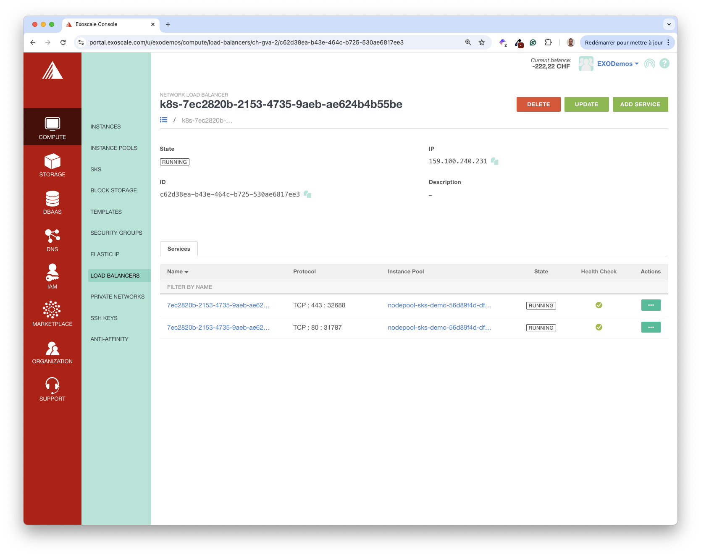

In this section, you’ll expose the VotingApp to the internet using a Network Load Balancer.

## Installing Traefik

First, we install a Traefik-based Ingress Controller in the cluster:

```bash
helm repo add traefik https://traefik.github.io/charts
helm install traefik traefik/traefik --version 33.2.1 -n traefik --create-namespace
```

In the background, this creates a Kubernetes Service of type LoadBalancer responsible for exposing the Traefik Ingress Controller. This Service triggers the creation of a Network Load Balancer on the Exoscale infrastructure to expose the Ingress Controller to the internet. From the Exoscale portal, we can get the details of this Load Balancer, including its IP address.



You can also get the LoadBalancer’s IP Address from the command line:

```bash
$ kubectl get svc -n traefik
NAME      TYPE           CLUSTER-IP      EXTERNAL-IP       PORT(S)                      AGE
traefik   LoadBalancer   10.107.18.143   159.100.240.231   80:31787/TCP,443:32688/TCP   73s
```

> [!WARNING]
> Your IP address will be different from the one above.

Deploying the application with Helm provides additional configuration options, including how the application should be exposed. Upgrade the application so it creates an Ingress resource.

First, define the configuration of the application Helm’s chart:

```yaml {filename="values.yml"}
ingress:
  enabled: true
  hosts:
    vote: vote.votingapp.cc
    result: result.votingapp.cc
```

Next, upgrade the application using these properties:

```bash
helm upgrade --install vote oci://registry-1.docker.io/voting/app --version v1.0.36 --namespace vote --create-namespace -f values.yaml
```

If you open your browser at [http://vote.votingapp.cc](http://vote.votingapp.cc) or [http://result.votingapp.cc](http://result.votingapp.cc), you’ll get a 404 error. This is expected as you did not define any DNS record for the default subdomains.

To fix this, modify your /etc/hosts file adding local DNS resolution:

NOTE: you need to use the IP address of your own LoadBalancer

```bash {filename="/etc/hosts"}
...
159.100.240.231 vote.votingapp.cc
159.100.240.231 result.votingapp.cc
```


If you do not have permission to modify your */etc/hosts*, you can temporarily use [nip.io](https://nip.io), a handy DNS resolver tool. For example, with *nip.io*, the domain *vote.159.100.240.231.nip.io* automatically resolves to *159.100.240.231.*

Modify the *values.yaml* using the IP address of your Load Balancer:

```yaml {filename="values.yaml"}
ingress:
  enabled: true
  hosts:
    vote: vote.159.100.240.231.nip.io
    result: result.159.100.240.231.nip.io
```

Then, upgrade the application:

```bash
helm upgrade --install vote oci://registry-1.docker.io/voting/app --version v1.0.36 --namespace vote --create-namespace -f values.yaml
```

Open a browser at http://vote.LOAD_BALANCER_IP.nip.io to access the application.


> [!WARNING]
> Before going any further, make sure to remove the changes we made previously in the /etc/hosts file.

While *nip.io* is a convenient tool, it cannot be used to expose applications on a specific domain. We’ll explore this part in detail in the next section.

> [!INFO]
> Want to know more about Exoscale Network Load Balancer? Visit the [documentation](https://community.exoscale.com/product/networking/nlb/) to get the entire feature set.