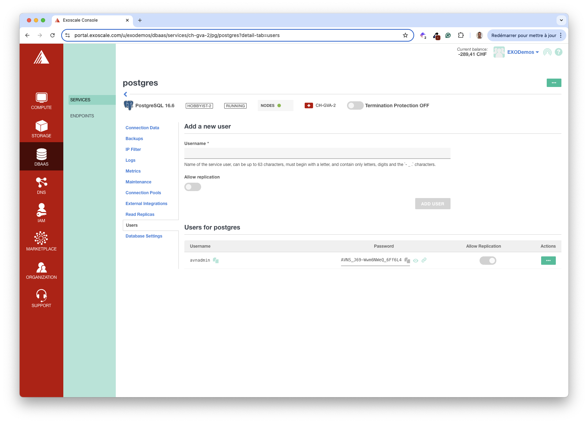
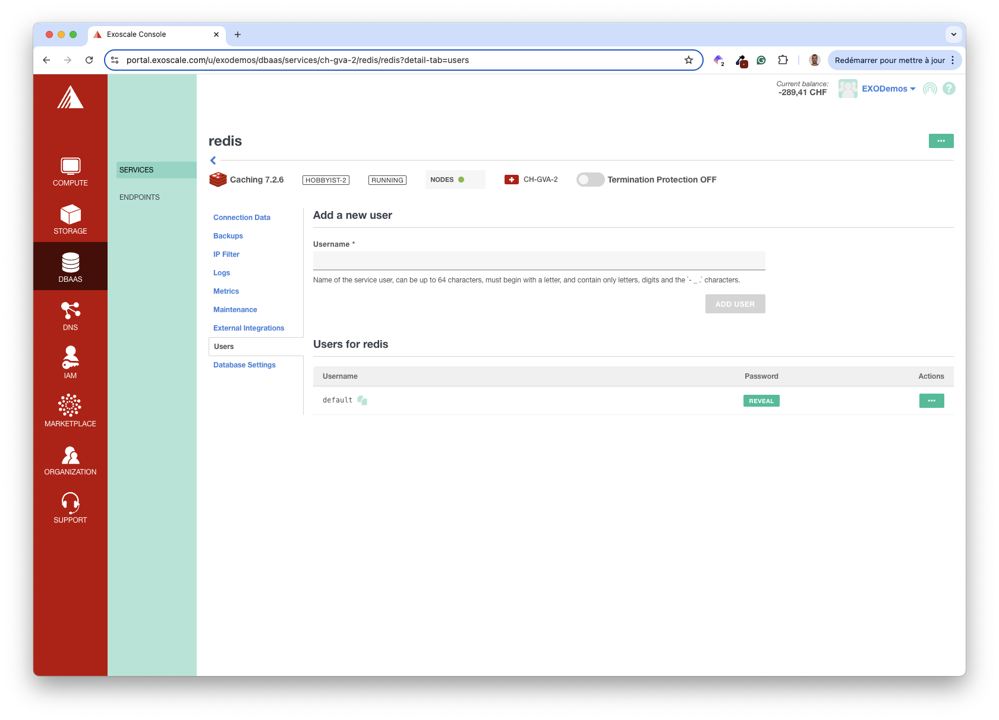

By default, the VotingApp deploys its own Redis and Postgres databases. In this section, you’ll use Exoscale managed databases (DBaaS) instead.

## Creating a Postgres DBaaS

From the DBAAS menu, create a Postgres database.


Provide a name (*postgres* in this example) and permit access from all IP addresses (*0.0.0.0/0*).

> [!WARNING]
> We would limit the range of IP addresses to the strict minimum for a production database.


After a few tens of seconds, the database is ready to be used.


Get the database connection string.


Next, get the admin password.




> [!WARNING]
> We would create an additional user for a production database and use it instead of the admin one.

In the current example, the database connection string is the following one.

```bash
<POSTGRES_CONNECTION_STRING>
```

## Creating a Cache DBaaS (Redis compatible)

From the DBAAS menu, create a Cache database.


Enter the database’s name (*redis* in this example) and allow access from all IP Address (*0.0.0.0/0*).

> [!WARNING]
> We would limit the range of IP addresses to the strict minimum for a production database.


After a few tens of seconds, the database is ready to be used.


Get the database connection string.


Next, get the admin password.




> [!WARNING]
> For a production database, we would create an additional user and use it instead of the admin one.

In the current example, the database connection string is the following one.

```bash
<REDIS_CONNECTION_STRING>
```

## Storing connection strings in Vault

Login using the root token.

```bash
vault login
```

Create a secret for each connection string.

```bash
vault kv put votingapp/pg/url url="postgres://avnadmin:<POSTGRES_PASSWORD>@..."
vault kv put votingapp/redis/url url="rediss://default:<REDIS_PASSWORD>@..."
```

Add read capabilities for the *redis* related secrets in the *policy.hcl* file.

```bash
path "votingapp/data/pg" {
  capabilities = ["read"]
}

path "votingapp/data/pg/*" {
  capabilities = ["read"]
}

path "votingapp/data/redis" {
  capabilities = ["read"]
}

path "votingapp/data/redis/*" {
  capabilities = ["read"]
}
```

Upgrade the policy so it can also read redis related secrets.

```bash
vault policy write votingapp-readonly policy.hcl
```

## Upgrade the application

Modify the application configuration so it uses external-secret to fetch the connection strings from Vault.

```yaml {filename="values.yaml"}
# Postgres configuration
postgres:
  connection:
    externalSecrets:
      enabled: true
      key: votingapp/data/pg/url
      field: url

# Redis configuration
redis:
  externalSecrets:
    enabled: true
    key: votingapp/data/redis/url
    field: url
...
```

Next, update the application.

```bash
helm upgrade --install vote oci://registry-1.docker.io/voting/app --version v1.0.36 --namespace vote --create-namespace -f values.yaml
```

List the running Pods. The db and redis Pods are no longer running as the application now uses external databases.

```bash
$ kubectl get po -n vote
NAME                         READY   STATUS    RESTARTS   AGE
result-c744b9765-2hpf6       1/1     Running   0          16s
result-ui-6f58969896-g7tsx   1/1     Running   0          16s
vote-567bc9f6d5-njvph        1/1     Running   0          16s
vote-ui-866b66996f-kbxt4     1/1     Running   0          16s
worker-77f6588f5f-5b2rx      1/1     Running   0          16s
```

Verify the application is still working fine.


> [!INFO]
> Want to know more about Exoscale Database as a Service offering? Visit the [documentation](https://community.exoscale.com/product/dbaas/) to get the entire feature set.