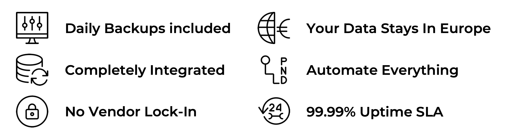

### Exoscale DBaaS Features

 

#### **Daily Backups included**

Backups are done on a daily basis and are included with every DBaaS offering.

#### **Completely Integrated**

Integrated DBaaS for your instances. Easily manage your database, instance, or storage from the same interface.

#### **No Vendor Lock-In**

Keep your cloud infrastructure independent and flexible with our offering of open source databases.

#### **Your Data Stays In Europe**

All data is stored in the country of your chosen zone, fully GDPR-compliant. DBaaS is available across European zones.

#### **Automate Everything**

Easily automate everything with our simple web portal, CLI, API or tools like Terraform.

#### **99.99% Uptime SLA**

All DBaaS (cluster) offerings come with an uptime SLA of 99.99%.