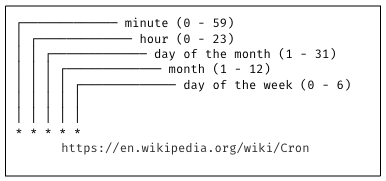
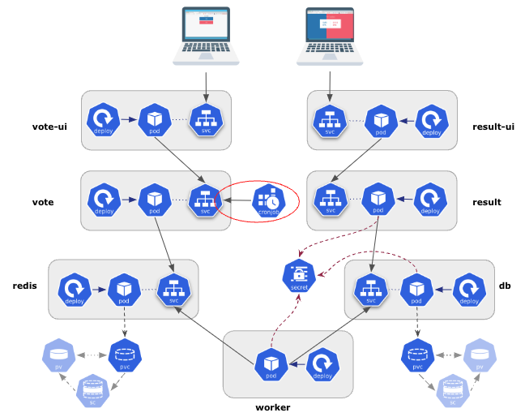

## What is a Job ?

A Job is used to launch batch-jobs. It can either:  

- launch a single Pod
- launch several Pods in parallel or in sequence

### Sample specification

The following specification defines a simple Job which runs 3 Pods sequentially, each Pod waits 10 seconds and displays a simple text on its standard output:

``` yaml
apiVersion: batch/v1                 
kind: Job
metadata:
  name: hello
spec:
  completions: 3  # (1)
  parallelism: 1  # (2)
  template:
    spec:
      restartPolicy: OnFailure
      containers:
      - name: hello
        image: alpine
        args:
        - /bin/sh
        - -c
        - sleep 10; echo Hello from kube
```

1. The job will terminate when 3 Pods have reached the “Completed” status

2. Pods run one after the other

## What is a CronJob ?

A CronJob is used to run Jobs at regular intervals. It is kind of similar to Linux crontab.  
Several use case examples:  

- database backups
- data processing
- sending marketing emails

### Sample specification

The following specification defines a CronJob which create a Job (based on the previous spec) every minute:

``` yaml
apiVersion: batch/v1
kind: CronJob
metadata:
  name: hello
spec:
  schedule: "* * * * *" 
  jobTemplate:
    spec:
      template:
        spec:
          restartPolicy: OnFailure
          containers:
          - name: hello
            image: alpine
            args:
            - /bin/sh
            - -c
            - sleep 10; echo Hello from kube
```



## Using a CronJob with the VotingApp

The previous exercise left the app with the following components:


We will now add a CronJob in charge of creating a couple of dummy votes every minute:



