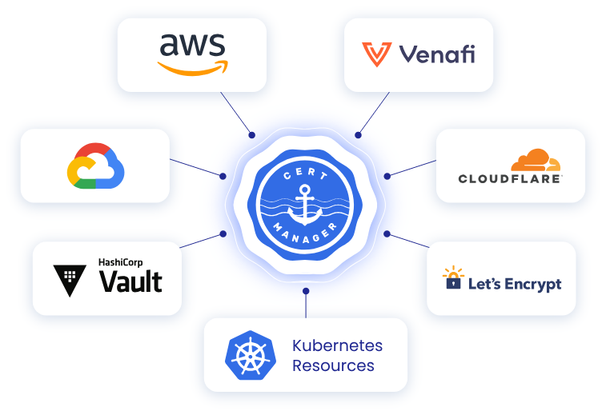
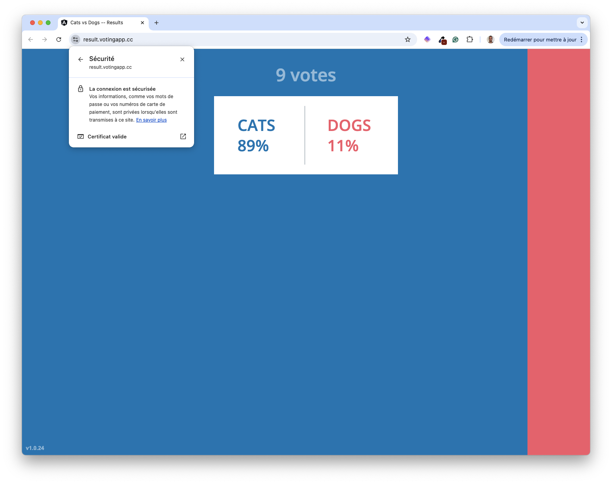
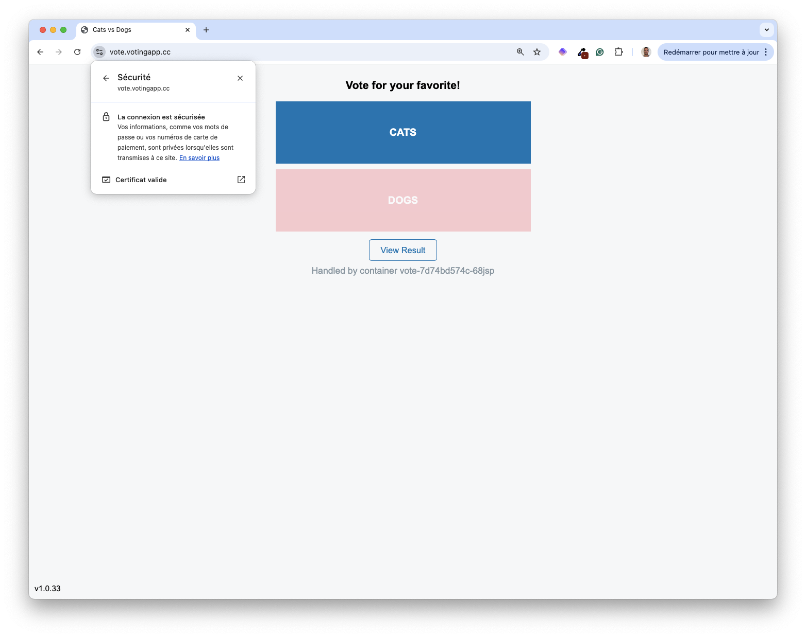
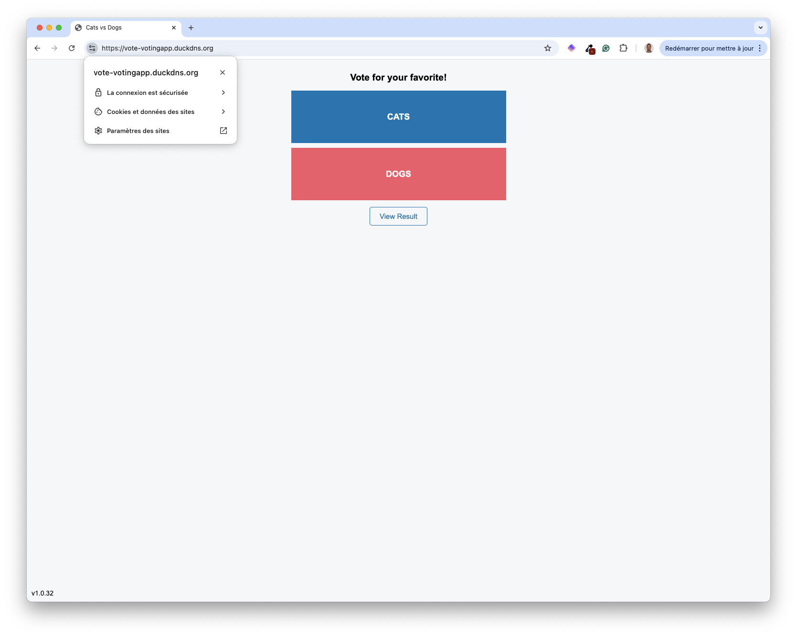

> [!WARNING]
> While configuring TLS is recommended for security, you can still access your app without it for this workshop. Follow the optional steps to enable TLS using Let’s Encrypt.

In the previous section, you exposed the VotingApp frontends on your own subdomains, or you used duckdns.org to create ones. Both interfaces are accessible through plain HTTP, which is not secure. In this section we’ll detail how to expose the application through HTTPS.

> [!NOTE]
> This example uses *votingapp.cc* domain. If you follow along, feel free to use your own domain name.

## Installing Cert-Manager

[Cert-manager](https://cert-manager.io) is a widely used tool of the Kubernetes ecosystem, it automates the issuance and renewal of TLS certificates. It integrates with various Certificates Authorities, including Let’s Encrypt the one we’ll use in this example.



Install Cert-manager in your cluster using Helm:

```bash
helm repo add cert-manager https://charts.jetstack.io
helm install cert-manager cert-manager/cert-manager --version 1.16.2 -n cert-manager --create-namespace --set crds.enabled=true
```

Next, create a file named *clusterissuer.yaml* with the following content. This defines a resource of type ClusterIssuer which specifies the CA used to request a certificate and the challenge used to prove the ownership of the domain (HTTP01 in this example).

> [!NOTE]
> Replace the placeholder YOUR_EMAIL_ADDRESS with your real email address before creating this resource.

```yaml {filename="clusterissuer.yaml"}
apiVersion: cert-manager.io/v1
kind: ClusterIssuer
metadata:
  name: letsencrypt
spec:
  acme:
    email: YOUR_EMAIL_ADDRESS
    server: https://acme-v02.api.letsencrypt.org/directory
    privateKeySecretRef:
      name: acme-account-key
    solvers:
    - http01:
       ingress:
         class: traefik
```

> [!NOTE]
> In this example, we use LetsEncrypt’s production environment. For testing purposes, we could use the staging environment whose URL is https://acme-staging-v02.api.letsencrypt.org/directory. This is a good way to test certificate issuance, and it provides higher rate limits.

Then, create the resource.

```bash
kubectl apply -f clusterissuer.yaml
```

## Updating the application

First, enable TLS using the dedicated property in the *values.yaml* file:

```yaml
ingress:
  enabled: true
  tls:
    enabled: true                   # Enabling TLS
  hosts:
    vote: vote.votingapp.cc         # Replace with the domain you used in the previous section
    result: result.votingapp.cc     # Replace with the domain you used in the previous section
```

Next, update the application:

```bash
helm upgrade --install vote oci://registry-1.docker.io/voting/app --version v1.0.36 --namespace vote --create-namespace -f values.yaml
```

In the background, a Secret is created. It contains a TLS certificate for your subdomains.

```bash
$ kubectl get certificate -n vote
NAME       READY   SECRET     AGE
tls-vote   True    tls-vote   20m
```

## Accessing the application

Both *vote-ui* and *result-ui* web interfaces are now accessible through HTTPS.





> [!NOTE]
> If you are using free subdomain names from [DuckDNS](https://duckdns.org), you’ll get a similar result as TLS Certificates can be issued for these subdomains as well.
> !


