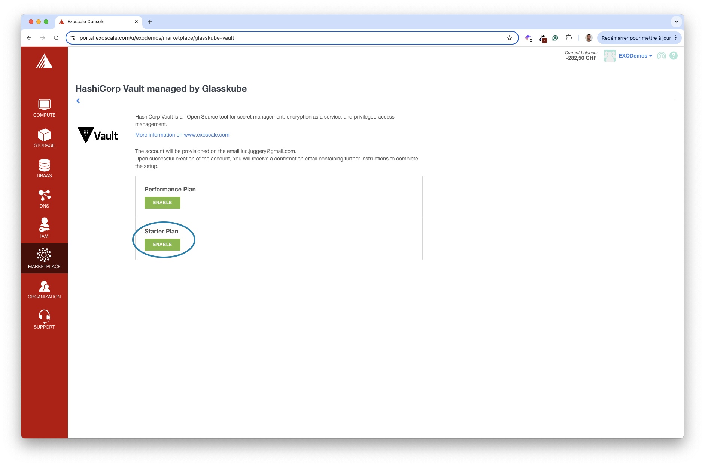
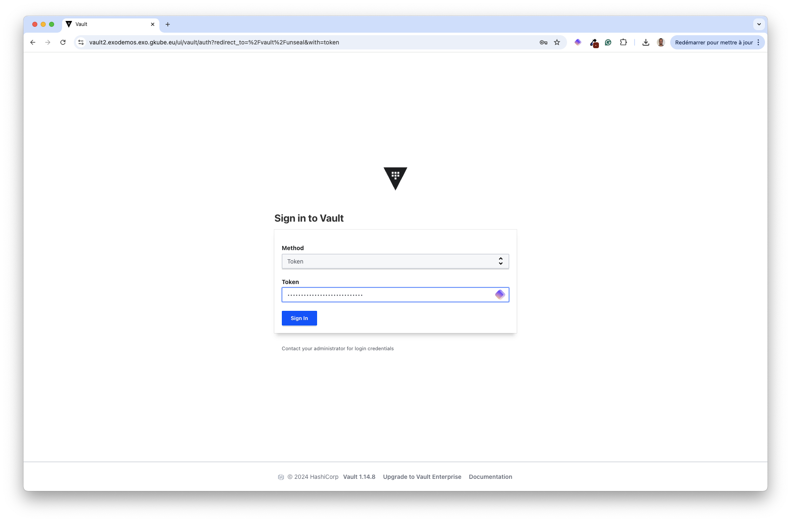
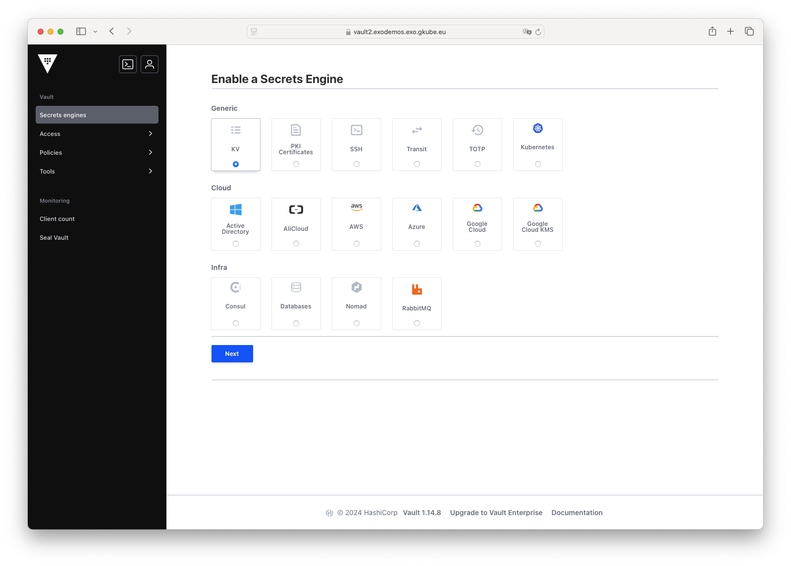
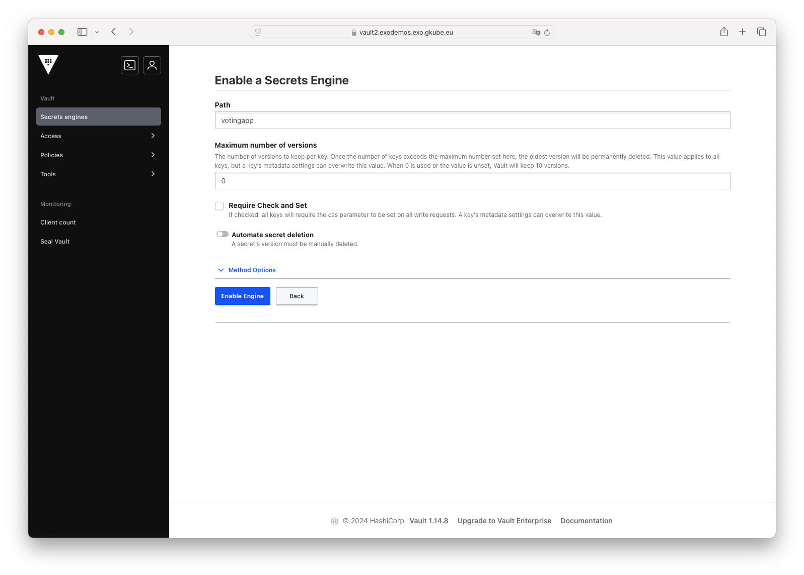

Since an application often needs access to sensitive data (e.g. SSH keys, login/password, …) to access other systems or APIs, we must ensure this information is stored securely. In this section, you’ll use a managed instance of HashiCorp Vault, available within Exoscale’s Marketplace.

> [!WARNING]
> Access to the managed Vault is free for 7 days. Make sure to remove your subscription once you have completed this workshop.

## Credentials used by the VotingApp

The VotingApp uses credentials to connect to its internal Postgres database. By default, these credentials are stored in plain text in the *values.yaml* file:

```yaml {filename="values.yaml"}
...
# Postgres configuration
postgres:
  credentials:
    username: postgres
    password: postgres
...
```

Since anyone with access to the Helm Chart can get the default values, we’ll store this information in an instance of HashiCorp Vault.

## Installing Vault

The Exoscale Marketplace provides various tools you can deploy in your organization in only a couple of clicks. HashiCorp Vault is one of these tools; it is in charge of managing sensitive data.

Click on *Manage* to start the installation of Vault.


Next, enable the starter plan.



Then, confirm your choice.


This activates the starter plan, which is a single Vault instance.


After a couple of minutes, you should receive an email like the following. It contains a link to your Glasskube console. Glasskube is the Exoscale partner that provides the managed Vault service.


The console allows you to configure your Vault instance. Leave the default values, acknowledge the T&C, and click on Save.


Your Vault environment is building.


After a few minutes, you’ll receive another email with the address of your Vault.


Using this URL, you’ll be able to select the number of keys to seal/unseal your Vault.


Download the keys and save them in a secure location on your local machine.


Use 2 of the keys to unseal the Vault.


Once the Vault is unsealed, use the root token to log in.



You can now configure the way you want to store your sensitive data.


## Creating new secrets

First, create a kv (key-value) store, which you’ll use to save the Postgres credentials.



Specify *votingapp* in the Path and validate the creation.



We’ll perform the next actions using vault cli instead of using the web interface.

First, install the Vault binary following [these instructions](https://developer.hashicorp.com/vault/tutorials/get-started/install-binary)

Next, using the URL of your Vault instance, log in with the vault binary:

```bash
export VAULT_ADDR="https://vault2.exodemos.exo.gkube.eu"
vault login
```

> [!WARNING]
> For this workshop, log in using the root token. However, in a production environment, it is recommended to use the token of a dedicated user.

Next, create 2 secrets containing the Postgres username and the password respectively. In this example, we use the same value *postgres123* for both.

```bash
vault kv put votingapp/pg/username username=postgres123
vault kv put votingapp/pg/password password=postgres123
```

Next, define a policy allowing read access to the data within the *votingapp* kv store:

```bash
path "votingapp/data/pg" {
  capabilities = ["read"]
}

path "votingapp/data/pg/*" {
  capabilities = ["read"]
}
```

Next, create the policy votingapp-readonly based on the content of this file:

```bash
vault policy write votingapp-readonly policy.hcl
```

Then, create a token attached to this policy and save it in the VAULT_TOKEN environment variable.

```bash
vault token create -policy=votingapp-readonly
```

Finally, login using this token:

```bash
vault login
```

Verify you can read the content of the secrets:

```bash
vault kv get votingapp/pg/username
vault kv get votingapp/pg/password
```

The Postgres credentials are stored in the Vault. In the next section, you’ll ensure these credentials are fetched from Vault when used by the VotingApp.

## Installing external-secrets

[External-secret](https://external-secrets.io/latest/) is widely used in the Kubernetes ecosystem. This component allows Kubernetes Secrets to be created from content stored in an external system like Hashicorp Vault, KMS, etc.

First, install external-secret using Helm:

```bash
helm repo add external-secrets-operator https://charts.external-secrets.io/
helm install external-secrets external-secrets-operator/external-secrets --version 0.12.1 -n external-secret --create-namespace
```

Next, create a Kubernetes Secret containing the token to access Vault. External-secret needs access to Vault to fetch the sensitive data.

```bash
kubectl -n vote create secret generic vault-token --from-literal=token=$VAULT_TOKEN
```

Next, create a SecretStore, which defines the location of the secrets.

```bash
cat <<EOF | kubectl apply -f -
apiVersion: external-secrets.io/v1beta1
kind: SecretStore
metadata:
  name: vault
  namespace: vote
spec:
  provider:
    vault:
      server: "${VAULT_ADDR}"
      path: votingapp
      version: "v2"
      auth:
        tokenSecretRef:
          name: "vault-token"
          key: "token"
EOF
```

In the next part, you’ll verify that the external-secrets component is working as expected.

## Verifying the installation

Since External-secret is in charge of creating a Kubernetes Secret from a resource of type ExternalSecret, first define the specification of an ExternalSecret as follows. Using this CRD, external-secret will trigger the creation of a Kubernetes Secret containing a single piece of data (*username*), which value is fetched from Vault in *votingapp/pg/username*.

```yaml {filename="external-secret.yaml"}
apiVersion: external-secrets.io/v1beta1
kind: ExternalSecret
metadata:
  name: example
  namespace: vote
spec:
  refreshInterval: "15s"
  secretStoreRef:
    name: vault
    kind: SecretStore
  target:
    name: example
  data:
  - secretKey: username
    remoteRef:
      key: votingapp/data/pg/username
```

Next, create the resource:

```bash
kubectl apply -f external-secret.yaml
```

In the background, you should notice a Secret was created in the vote namespace. This one has the property *username* in the data section:

```bash
kubectl describe secret example -n vote
```

Decode the value of this property, and make sure you get *postgres123* as you set in Vault in the previous step.

```bash
kubectl get secret example -o jsonpath='{.data.username}' | base64 --decode
se64 -d
```

Getting the VotingApp Postgres credentials from Vault

In this step, you’ll ensure the credentials of the Postgres database are not specified in plain text anymore but are fetched securely from Vault instead.

First, update your local *values.yaml* file to enable the usage of the external secrets.

```yaml {filename="values.yaml"}
...
# Postgres configuration
postgres:
  credentials:
    externalSecrets:
      enabled: true
      username:
        key: votingapp/data/pg/username
        field: username
      password:
        key: votingapp/data/pg/password
        field: password
```

Next, upgrade the application so it uses these new values:

```bash
helm upgrade --install vote oci://registry-1.docker.io/voting/app --version v1.0.36 --namespace vote --create-namespace -f values.yaml
```

You should observe that a new Secret *db* was created by external-secret:

```bash
$ kubectl describe secret db -n vote
Name:         db
Namespace:    vote
Labels:       app.kubernetes.io/managed-by=Helm
              reconcile.external-secrets.io/created-by=445c7bf8e3fe4d8835c510c6c181bb32
              reconcile.external-secrets.io/managed=true
Annotations:  meta.helm.sh/release-name: vote
              meta.helm.sh/release-namespace: vote
              reconcile.external-secrets.io/data-hash: a6bf97deb5a0cafd44194346e47151bf

Type:  Opaque

Data
====
POSTGRES_PASSWORD:  11 bytes
POSTGRES_USER:      11 bytes
```

It contains the information stored in the Vault (*postgres123* instead of the default *postgres*):

```bash
$ kubectl get secret db -n vote -o jsonpath='{.data.POSTGRES_USER}' | base64 --decode
postgres123
```

The credentials are not stored in plain text in the *values.yaml* file anymore. They are now securely stored in Vault.

> [!INFO]
> Visit the [Exoscale Marketplace](https://www.exoscale.com/marketplace/) to get the entire list of available templates and services you can use for your own applications.