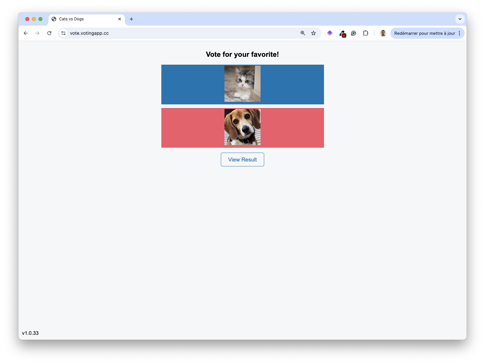
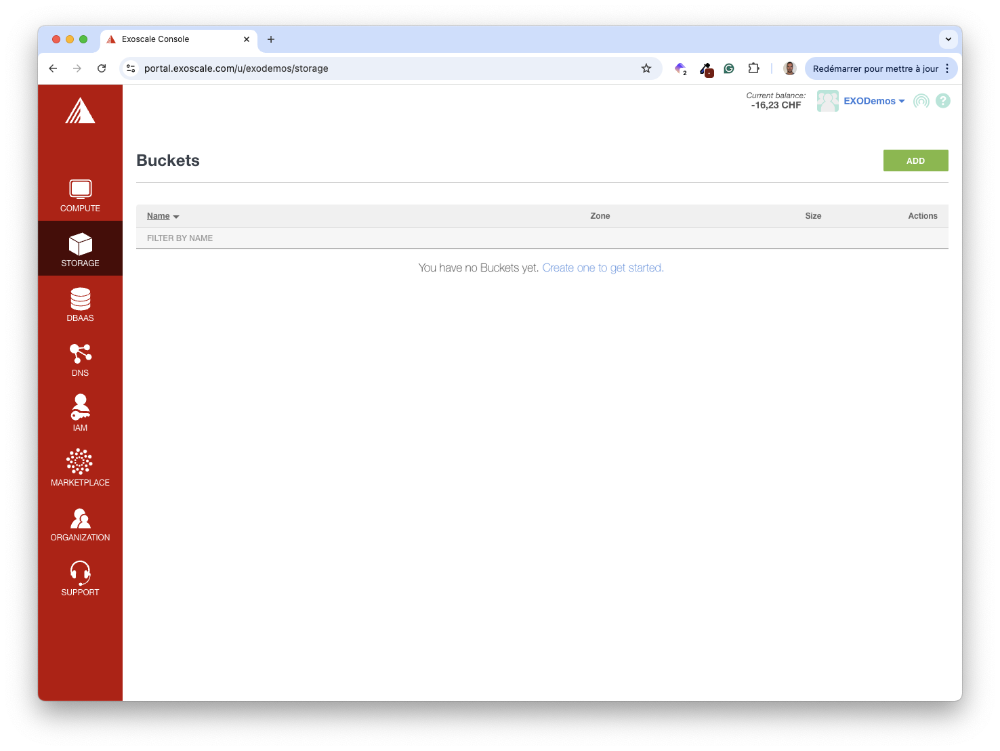
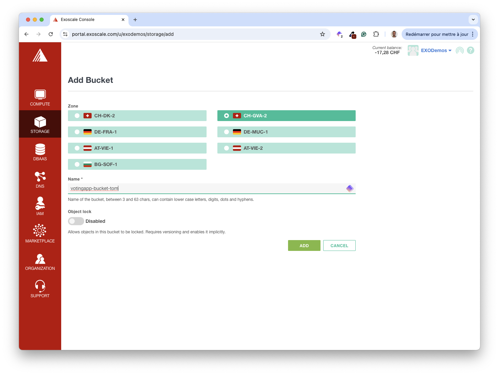
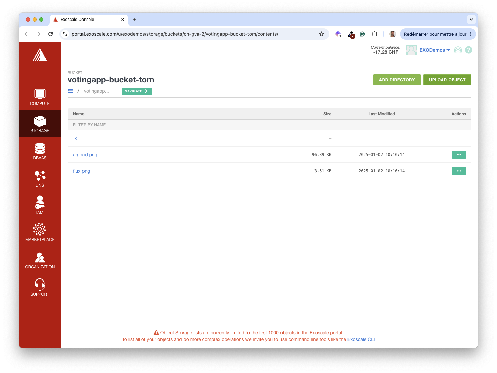
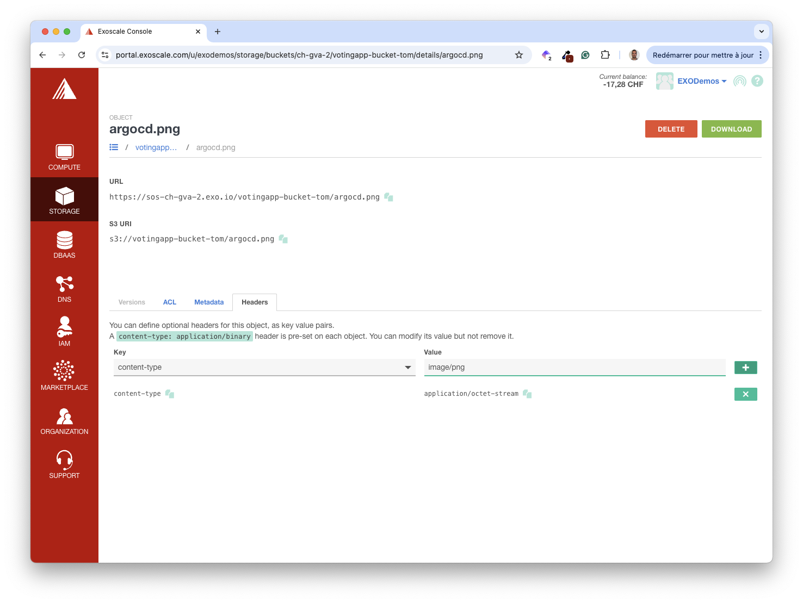
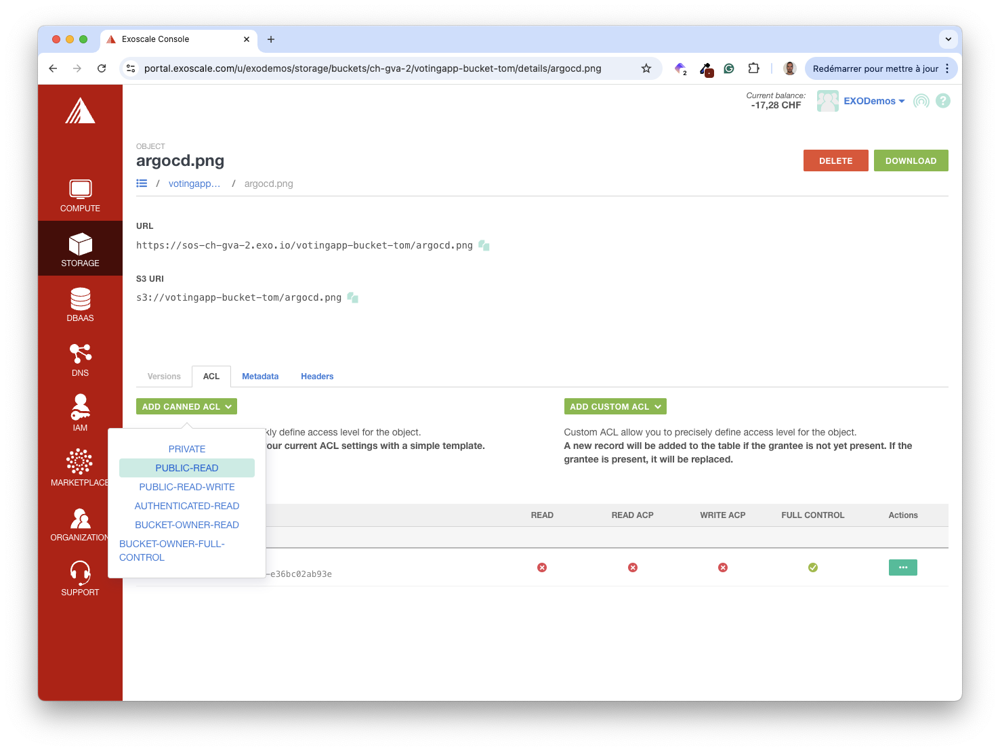
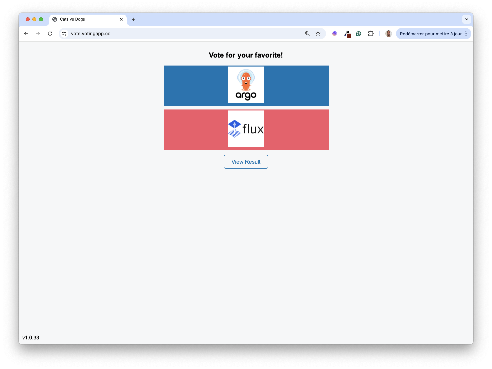
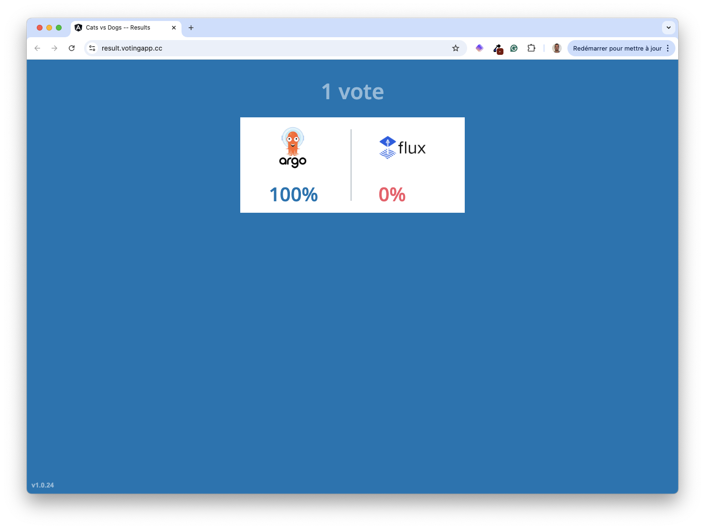

In this section, you’ll use Simple Object Storage (SOS), an Exoscale AWS S3-compatible storage service, to store images used by the VotingApp.

## Using images instead of labels

The VotingApp allows dynamic configuration of labels and images. The default configuration is below; it uses string labels for cats and dogs.

```bash
# Dynamic configuration
items:
  labels:
    a: "cats"
    b: "dogs"
  images:
    enabled: false
    a: https://sos-ch-gva-2.exo.io/votingapp/items/a.png
    b: https://sos-ch-gva-2.exo.io/votingapp/items/b.png
```

Modify your current *values.yaml* file, so it allows using images instead of labels.

```yaml {filename="values.yaml"}
items:
  images:
    enabled: true
```

> [!WARNING]
> By default, it uses images available at the following URLs:
> - https://sos-ch-gva-2.exo.io/votingapp/items/a.png
> - https://sos-ch-gva-2.exo.io/votingapp/items/b.png

Next, upgrade the application.

```bash
helm upgrade --install vote oci://registry-1.docker.io/voting/app --version v1.0.36 --namespace vote --create-namespace -f values.yaml
```

The *vote-ui* and *result-ui* web interfaces should now display images as follows:




In the next part, you’ll use your images.

## Create a bucket

First, go to the Storage section.



Next, create a bucket.



> [!WARNING]
> Since bucket names are global, do not use generic names, as somebody may already use them.


Next, explore the bucket’s detailed page and select the “Upload Object” action.


Select two images from your local machine.

> [!INFO]
> Please use square PNG images



Change the “content-type” header into “image/png” for each image.



Next, add the PUBLIC_READ ACL to make the images public.



From the image’s detail page, get the public URL and use it in the *values.yaml* file as follows:

```yaml {filename="values.yaml"}
items:
  images:
    enabled: true
    a: https://sos-ch-gva-2.exo.io/votingapp-bucket-tom/argocd.png  # Use the URL of your image
    b: https://sos-ch-gva-2.exo.io/votingapp-bucket-tom/flux.png    # Use the URL of your image
```

```bash
helm upgrade --install vote oci://registry-1.docker.io/voting/app --version v1.0.36 --namespace vote --create-namespace -f values.yaml
```





> [!INFO]
> Want to know more about Exoscale Object Storage offering? Visit the [documentation](https://community.exoscale.com/product/storage/) to get the entire feature set.

