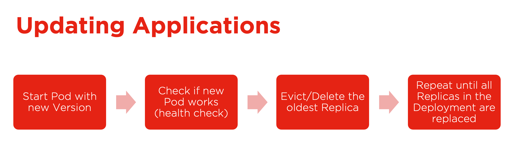

### **Updates Theory**

The manifest concept is very versatile for creating and orchestrating Kubernetes structures but also updating. Declaring the new situation and triggering the update, Kubernetes takes care of the rest, which means following a clearly defined workflow of process steps to update all distributed components and safely removing old versions.

The details are explained in the video below.

#### **Updates Theory**

<video width="100%" height="100%" controls>
    <source src="https://sos-de-fra-1.exo.io/exoscale-academy/videos/sks_advanced_vid9.mp4?1752690262986" type="video/mp4">
    Your browser does not support the video tag.
</video>
