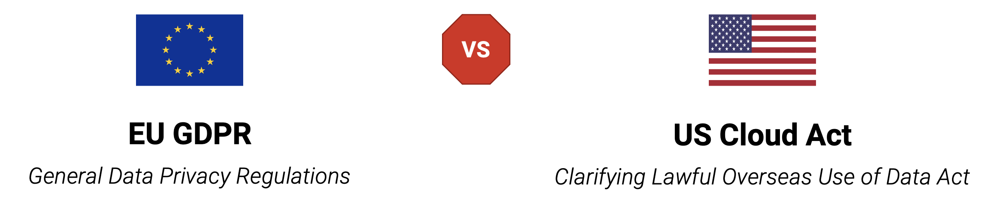

### **GDPR vs. CLOUD Act**

**GDPR**: protect personal data, valid for all companies operating in the EU, fines at non-compliance

**CLOUD Act**: hand over personal data to the US government, valid for all US-owned companies, fines or prison at non-compliance

### **Exoscale's Compliance - Frameworks / Web / Centers**

**Exoscale's Compliance Web**

Full compliance to global and local security frameworks, certified by world's most stringent auditors, to enable a smooth and safe adoption of our cloud platform by SaaS providers and enterprises in every sector.

exoscale.com/compliance/

**Exoscale's Compliance Center**

Exoscale is committed to helping our customers achieve and maintain compliance with industry and government regulations. In our Compliance Center, you will find all the information you need to know about our compliance posture.

This includes information about our security controls, policies and procedures, as well as certificates, attestations and compliance reports. We will continue to update this center as our compliance posture evolves. If you have any questions about our compliance posture or would like more information, please contact:

support@exoscale.com