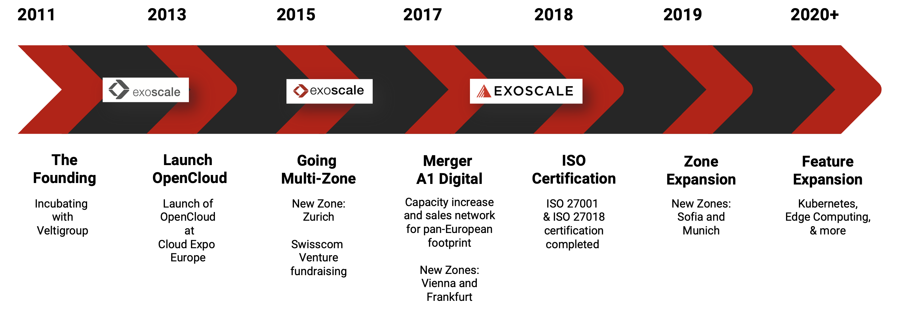
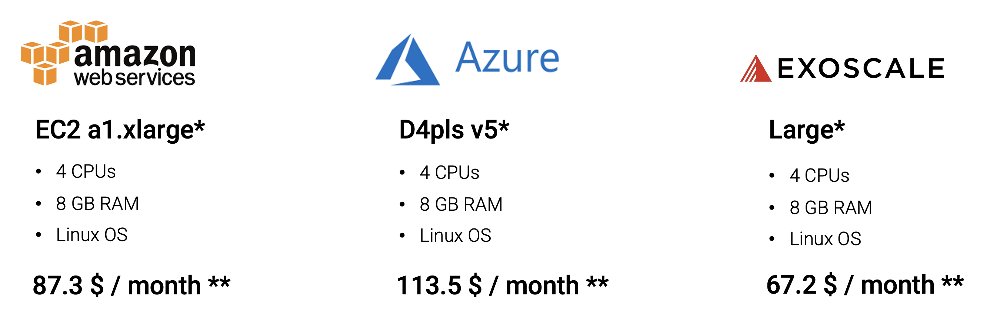
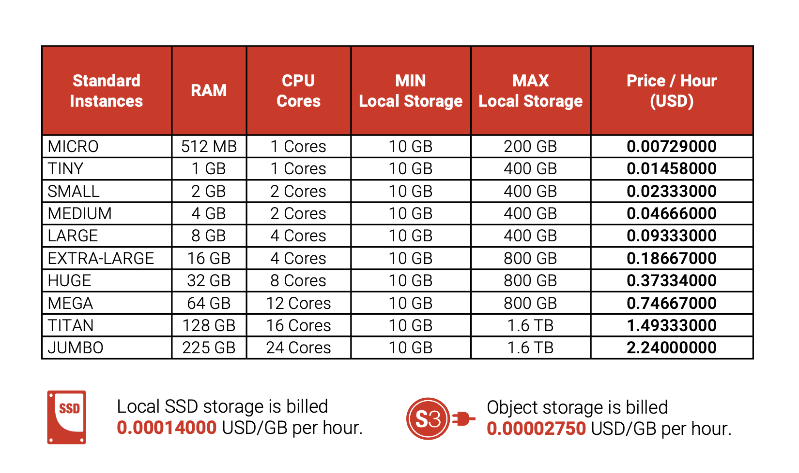

### **USPs**

#### **Performance**
**Larger bar is better**
- Single Score - CPU Performance
- Multi Score - System Performance (transparent bars)

#### **European**

#### **Affordable**

#### **Transparent**

#### **Compliant**
- Your data processing and storing with Exoscale is **fully GDPR-compliant**.
- Exoscale is **not** effected by the **US Cloud Act**.
- GDPR non-compliance **fines** up to **€ 20.000.000** or **4 % of global turnover**.

